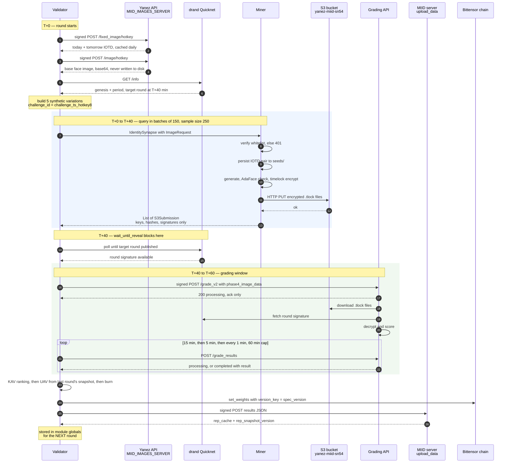
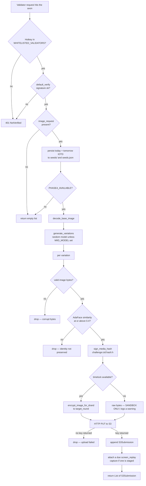
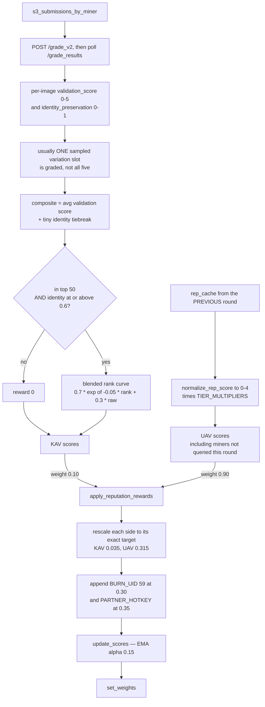
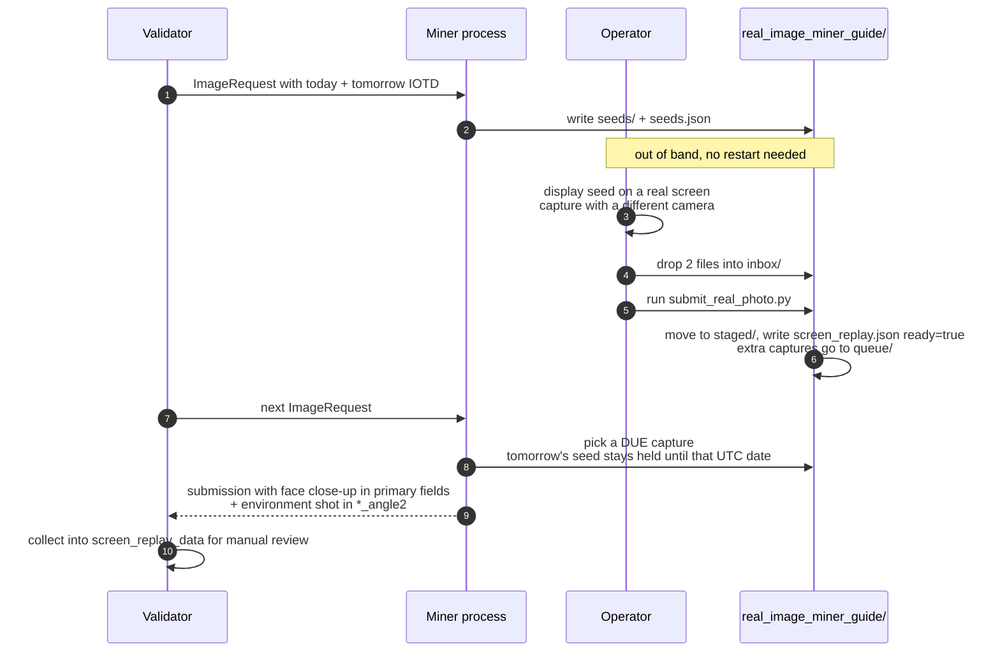

# Miner ↔ Validator Workflow

How one validation round actually runs, end to end. Diagrams are Mermaid, so they render
on GitHub. Terms are defined in the [Glossary](glossary.md).

The important thing to hold onto: **one `forward()` is a ~1 hour cycle, not a quick loop**,
and **raw images never cross the wire in either direction** — the miner returns signed S3
references to timelock-encrypted files that nobody can open until T+40 min.

---

## 1. One full round



### Timeline

| Window | What happens |
|--------|--------------|
| T+0 | Sample miners, fetch base image and IOTD pair, compute the drand target round, build the challenge. |
| T+0 – T+20 | Batch 1 queried (up to `batch_size`, default 150). |
| T+20 – T+40 | Batch 2 queried. |
| T+40 | Drand round publishes. Submissions become decryptable. |
| T+40 – T+60 | Grading API decrypts and scores, validator polls for results. |
| End | Weights set, results signed and uploaded, reputation snapshot cached for next round. |

Miners that answer fast do **not** shorten the round — the unlock is pinned to T+40 from
challenge start regardless.

---

## 2. What the validator sends and what comes back

```mermaid
flowchart LR
    subgraph REQ["ImageRequest — validator to miner"]
        direction TB
        R1["base_image — per-round face, base64"]
        R2["variation_requests — exactly 5"]
        R3["daily_seed_image — today's IOTD"]
        R4["tomorrow_seed_image — sent a day early"]
        R5["target_drand_round + reveal_timestamp"]
        R6["challenge_id"]
        R7["real_screen_replay_instructions"]
    end

    subgraph RES["List of S3Submission — miner to validator"]
        direction TB
        S1["s3_key — path to the .tlock file"]
        S2["image_hash — SHA-256 of the ORIGINAL bytes"]
        S3["signature — proves this miner made that file"]
        S4["variation_type"]
        S5["path_signature — namespaces the S3 prefix"]
        S6["s3_key_angle2 and screen_replay_uav<br/>screen_replay only"]
    end

    REQ -->|"IdentitySynapse"| RES
```



The five requested variations are always the same shape, built by
`build_standard_challenge_variations()`:

1. `background_in` — indoor, plus a weighted-random accessory
2. `background_out` — outdoor, plus a weighted-random accessory
3. `lighting_edit+expression_edit`
4. `lighting_edit+pose_edit`
5. `pose_edit+expression_edit`

`screen_replay` is deliberately **not** in this set — see [section 5](#5-the-screen-replay-side-channel).

On the timeout: `IdentitySynapse` declares `timeout: float = 120.0`, but the validator
overrides it per round with `--neuron.timeout` (default **1200 s**) when it constructs the
synapse. A miner sizing its pipeline should plan against 1200 s per batch, not 120.

---

## 3. Inside the miner

Two access checks run before any work starts, then the pipeline in
[`MIID/miner/submission_builder.py`](../MIID/miner/submission_builder.py) runs once per
variation. A variation that fails any step is dropped, not faked — the miner submits
fewer items rather than bad ones.



The S3 key is structured so one miner cannot write into another's prefix:

```
submissions/{challenge_id}/{hotkey}/{path_signature}/{seed_image_name}/{variation_type}_{ts}.png.tlock
                                     ^^^^^^^^^^^^^^^^
                                     sign("{challenge_id}:{hotkey}") hex, first 16 chars
```

Run the identical pipeline offline with
`python -m MIID.miner.dry_run_submission --image face.png` — it prints per-variation
outcomes and exits non-zero when nothing was produced.

---

## 4. How the response becomes a weight



Three things that trip people up here:

- **Burn is applied exactly once.** Either inside `get_image_variation_rewards(skip_burn=False)`
  when UAV grading is off, or inside `apply_reputation_rewards()` when it is on. Never both.
- **The returned arrays are not positionally aligned with `miner_uids`.**
  `apply_reputation_rewards()` adds unqueried miners, the burn UID and the partner UID.
  Always map by UID.
- **UAV reputation is always one round stale.** `rep_cache` arrives in the *upload response*
  at the end of a round and is used by the *next* one, so it is empty on a validator's first pass.

---

## 5. The screen-replay side channel

A `screen_replay` is a physical photograph or video of the IOTD shown on a real screen. It
is **not** generated, **not** part of the 5-variation set, and **not** KAV-graded — validators
collect it for manual review. It also does not follow the request/response rhythm: the
operator stages a capture whenever they have one, and the running miner attaches it to the
next validator request that comes in.



Every submission bundles **two distinct files** of the same capture — a face close-up
(photo or video, per `capture_variant`) and a wider environment still. Identical hashes are
rejected locally. Reviewers check cross-view consistency: same seed face on screen, same
bezel geometry, same lighting and glare direction, distinct hashes.

---

## 6. Failure paths worth knowing

| Situation | What happens |
|-----------|--------------|
| Miner hotkey not whitelisted on the validator's side | Request returns 401. The miner scores 0 for the round. |
| Miner has no image stack (`PHASE4_AVAILABLE` false) | It still registers and serves, returns `[]`, scores 0. |
| Protocol field mismatch between the two sides | HTTP 422, handled explicitly by `dendrite_with_retries()`. |
| ≤50 miners failed to respond | **No retry.** They get empty default responses. Retries fire only when *more* than 50 failed — the condition reads backwards at a glance but is deliberate. |
| Grading API never returns | Every miner gets 0.0 KAV for the round. |
| Nobody clears top-50 + the 0.6 identity floor | Burn event — 100% of the round's emissions burn. |
| `PARTNER_HOTKEY` absent from the metagraph | Its 35% is added to burn, so burn reverts to 65%. Miner share is unaffected. |
| Results upload fails | The allocation queues in `validator_results/pending_allocations.json` and is re-sent with the next round's payload. Local result files are deleted only after a successful upload, and only on mainnet. |

---

## Source map

| Step | File |
|------|------|
| Round orchestration | [`MIID/validator/forward.py`](../MIID/validator/forward.py) |
| Wire format | [`MIID/protocol.py`](../MIID/protocol.py) |
| Challenge construction | [`MIID/validator/image_variations.py`](../MIID/validator/image_variations.py) |
| Reveal timing | [`MIID/validator/drand_utils.py`](../MIID/validator/drand_utils.py) |
| Scoring and allocation | [`MIID/validator/reward.py`](../MIID/validator/reward.py) |
| Miner request handling | [`neurons/miner.py`](../neurons/miner.py) |
| Miner pipeline | [`MIID/miner/submission_builder.py`](../MIID/miner/submission_builder.py) |
| Upload and key layout | [`MIID/miner/s3_upload.py`](../MIID/miner/s3_upload.py) |
