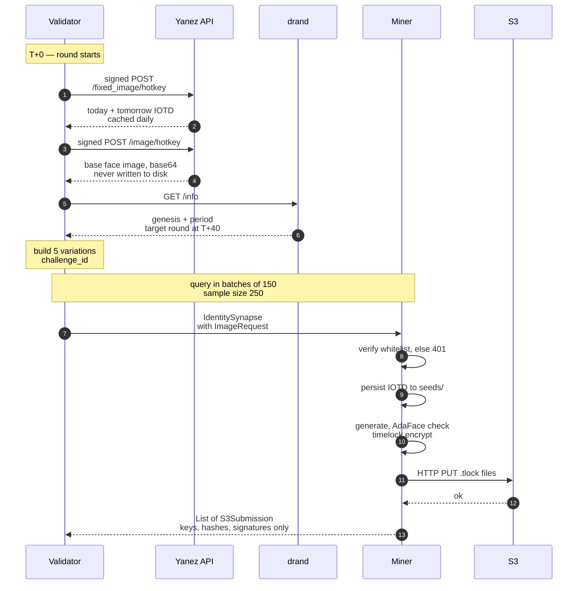
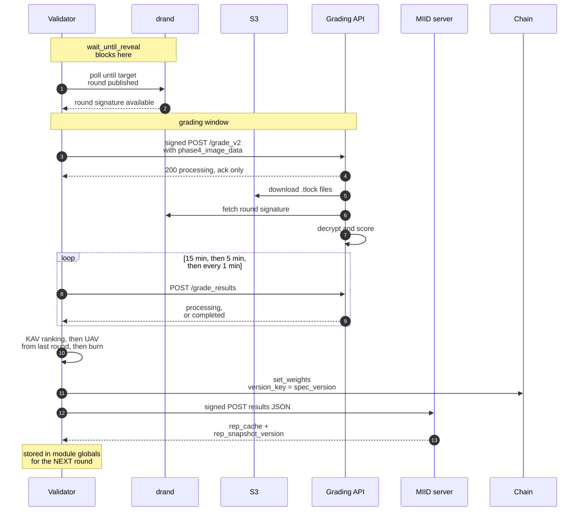
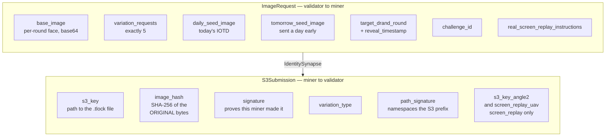
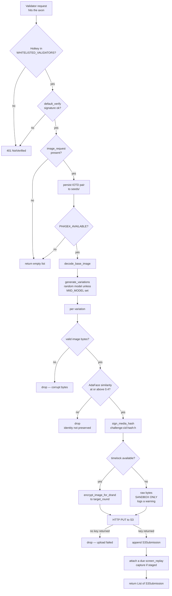
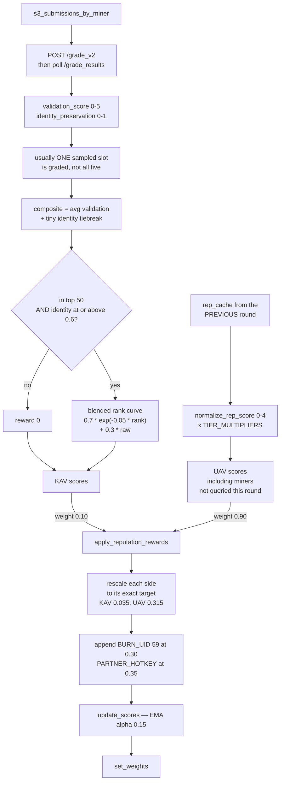
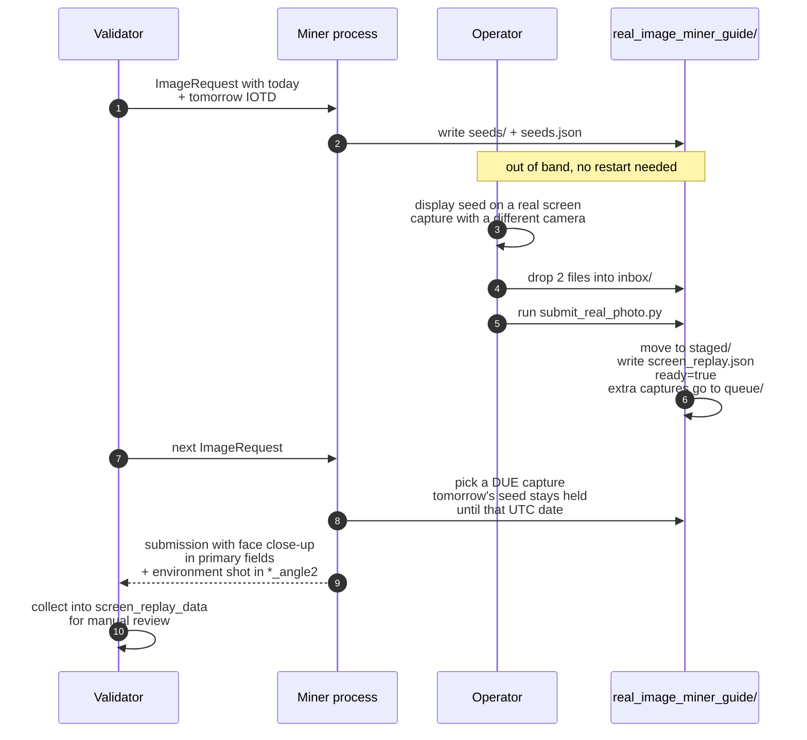
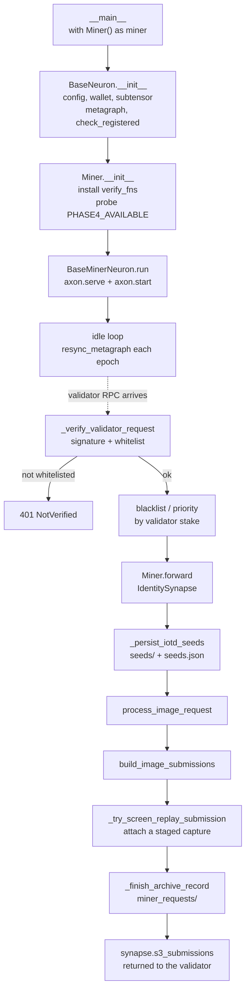
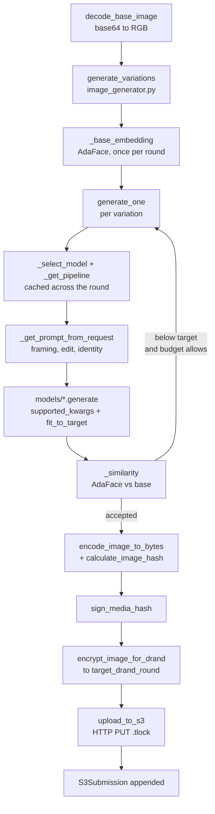
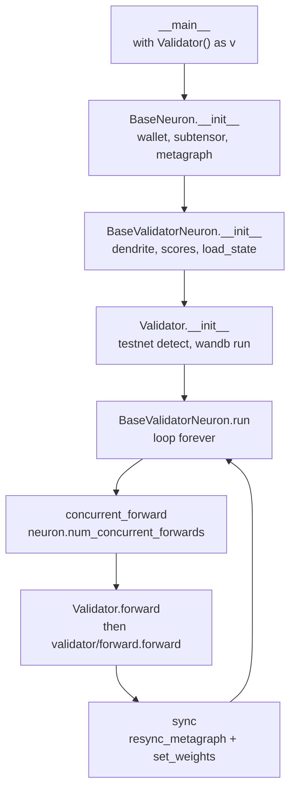
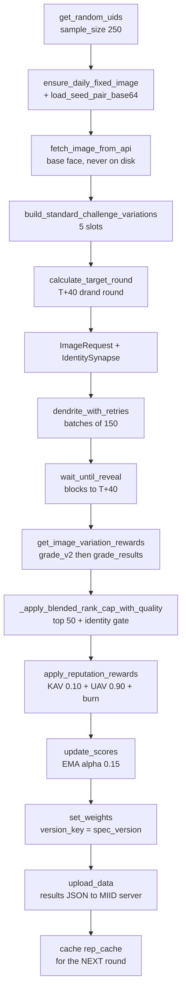

# Miner ↔ Validator Workflow

How one validation round actually runs, end to end. Diagrams are Mermaid, so they render
on GitHub. Terms are defined in the [Glossary](glossary.md).

The important thing to hold onto: **one `forward()` is a ~1 hour cycle, not a quick loop**,
and **raw images never cross the wire in either direction** — the miner returns signed S3
references to timelock-encrypted files that nobody can open until T+40 min.

---

## 1. One full round

Split in two so it stays readable — the second picks up where the first ends.

### T+0 to T+40 — build the challenge and query



### T+40 to T+60 — reveal, grade, set weights



### Timeline

| Window | What happens |
|--------|--------------|
| T+0 | Sample miners, fetch base image and IOTD pair, compute the drand target round, build the challenge. |
| T+0 – T+20 | Batch 1 queried (up to `batch_size`, default 150). |
| T+20 – T+40 | Batch 2 queried. |
| T+40 | Drand round publishes. Submissions become decryptable. |
| T+40 – T+60 | Grading API decrypts and scores, validator polls for results. |
| End | Weights set, results signed and uploaded, reputation snapshot cached for next round. |

Miners that answer fast do **not** shorten the round — the unlock is pinned to T+40 from
challenge start regardless.

---

## 2. What the validator sends and what comes back



The five requested variations are always the same shape, built by
`build_standard_challenge_variations()`:

1. `background_in` — indoor, plus a weighted-random accessory
2. `background_out` — outdoor, plus a weighted-random accessory
3. `lighting_edit+expression_edit`
4. `lighting_edit+pose_edit`
5. `pose_edit+expression_edit`

`screen_replay` is deliberately **not** in this set — see [section 5](#5-the-screen-replay-side-channel).

On the timeout: `IdentitySynapse` declares `timeout: float = 120.0`, but the validator
overrides it per round with `--neuron.timeout` (default **1200 s**) when it constructs the
synapse. A miner sizing its pipeline should plan against 1200 s per batch, not 120.

---

## 3. Inside the miner

Two access checks run before any work starts, then the pipeline in
[`MIID/miner/submission_builder.py`](../MIID/miner/submission_builder.py) runs once per
variation. A variation that fails any step is dropped, not faked — the miner submits
fewer items rather than bad ones.



The S3 key is structured so one miner cannot write into another's prefix:

```
submissions/{challenge_id}/{hotkey}/{path_signature}/{seed_image_name}/{variation_type}_{ts}.png.tlock
                                     ^^^^^^^^^^^^^^^^
                                     sign("{challenge_id}:{hotkey}") hex, first 16 chars
```

Run the identical pipeline offline with
`python -m MIID.miner.dry_run_submission --image face.png` — it prints per-variation
outcomes and exits non-zero when nothing was produced.

---

## 4. How the response becomes a weight



Three things that trip people up here:

- **Burn is applied exactly once.** Either inside `get_image_variation_rewards(skip_burn=False)`
  when UAV grading is off, or inside `apply_reputation_rewards()` when it is on. Never both.
- **The returned arrays are not positionally aligned with `miner_uids`.**
  `apply_reputation_rewards()` adds unqueried miners, the burn UID and the partner UID.
  Always map by UID.
- **UAV reputation is always one round stale.** `rep_cache` arrives in the *upload response*
  at the end of a round and is used by the *next* one, so it is empty on a validator's first pass.

---

## 5. The screen-replay side channel

A `screen_replay` is a physical photograph or video of the IOTD shown on a real screen. It
is **not** generated, **not** part of the 5-variation set, and **not** KAV-graded — validators
collect it for manual review. It also does not follow the request/response rhythm: the
operator stages a capture whenever they have one, and the running miner attaches it to the
next validator request that comes in.



Every submission bundles **two distinct files** of the same capture — a face close-up
(photo or video, per `capture_variant`) and a wider environment still. Identical hashes are
rejected locally. Reviewers check cross-view consistency: same seed face on screen, same
bezel geometry, same lighting and glare direction, distinct hashes.

---

## 6. Failure paths worth knowing

| Situation | What happens |
|-----------|--------------|
| Miner hotkey not whitelisted on the validator's side | Request returns 401. The miner scores 0 for the round. |
| Miner has no image stack (`PHASE4_AVAILABLE` false) | It still registers and serves, returns `[]`, scores 0. |
| Protocol field mismatch between the two sides | HTTP 422, handled explicitly by `dendrite_with_retries()`. |
| ≤50 miners failed to respond | **No retry.** They get empty default responses. Retries fire only when *more* than 50 failed — the condition reads backwards at a glance but is deliberate. |
| Grading API never returns | Every miner gets 0.0 KAV for the round. |
| Nobody clears top-50 + the 0.6 identity floor | Burn event — 100% of the round's emissions burn. |
| `PARTNER_HOTKEY` absent from the metagraph | Its 35% is added to burn, so burn reverts to 65%. Miner share is unaffected. |
| Results upload fails | The allocation queues in `validator_results/pending_allocations.json` and is re-sent with the next round's payload. Local result files are deleted only after a successful upload, and only on mainnet. |

---

## 7. End to end — process start to output

Sections 1–6 describe the round. This section follows the actual call chain, from the
command you type to the bytes that leave the process.

### 7.1 Miner — `python neurons/miner.py` to `List[S3Submission]`

Startup runs once; everything below `forward()` runs once per validator request.



Inside `build_image_submissions()` — one pass per requested variation:



### 7.2 Validator — `python neurons/validator.py` to `set_weights`



One `forward()` — the ~1 hour cycle:



### 7.3 The two outputs

| Side | Output | Written by |
|------|--------|------------|
| Miner | `List[S3Submission]` on the wire + `.tlock` objects in S3 | `build_image_submissions()` |
| Miner | `miner_requests/<date>/<record>/record.json` | `request_archive.write_record()` |
| Validator | weights on chain | `BaseValidatorNeuron.set_weights()` |
| Validator | results JSON to `MIID_SERVER/upload_data` | `MIID/utils/misc.upload_data()` |

---

## 8. Function reference

Every function on the live path, by file. Helpers are prefixed `_`.

### Entry points

**[`neurons/miner.py`](../neurons/miner.py)** — miner neuron, request handling, screen-replay side channel

| Function | Role |
|---|---|
| `_utc_today_str()` | Today's UTC date as `YYYY-MM-DD` |
| `Miner.__init__()` | Output dir, archive dir, installs `verify_fns`, logs Phase 4 env |
| `Miner._verify_validator_request()` | Rejects any RPC not cryptographically proven to come from a whitelisted validator |
| `Miner.forward()` | Request entry point — orchestrates everything below |
| `Miner.process_image_request()` | Thin delegate to `build_image_submissions()` |
| `Miner._persist_iotd_seeds()` | Writes today's/tomorrow's IOTD to `seeds/` |
| `Miner._new_archive_record()` / `_archive_media_dir()` / `_finish_archive_record()` | Open, locate, close the per-request archive record |
| `Miner._describe_screen_replay()` | Summarize whether a real capture rode along |
| `Miner._screen_replay_is_due()` | Whether a capture's IOTD may upload on today's UTC date |
| `Miner._iter_queued_screen_replays()` | Oldest-first queued captures |
| `Miner._pick_due_screen_replay()` | Choose the active slot, else the oldest due queued |
| `Miner._try_screen_replay_submission()` | Validate, encrypt, upload a real capture; attach `ScreenReplayUAV` |
| `Miner._promote_next_queued_screen_replay()` | Move the next due capture into the active slot |
| `Miner.blacklist()` / `Miner.priority()` | Second access check; stake-ordered queueing |
| `Miner.is_valid_image_bytes()` / `is_valid_video_bytes()` | Media sanity checks |

**[`neurons/validator.py`](../neurons/validator.py)** — validator neuron and wandb logging

| Function | Role |
|---|---|
| `Validator.__init__()` | Testnet detection, wandb run setup |
| `Validator.forward()` | Delegates to `MIID/validator/forward.forward()` |
| `Validator.new_wandb_run()` / `log_step()` | Create run, log one step |
| `Validator.cleanup_wandb_run_folder()` / `cleanup_all_wandb_runs()` / `manual_cleanup_wandb_runs()` | Disk hygiene |

### Base neuron classes

**[`MIID/base/neuron.py`](../MIID/base/neuron.py)** — `BaseNeuron`, shared by both sides: `config()`, `add_args()`, `check_config()`, `block()`, `sync()`, `check_registered()`, `should_sync_metagraph()`, `should_set_weights()`, `save_state()`, `load_state()`.

**[`MIID/base/miner.py`](../MIID/base/miner.py)** — `BaseMinerNeuron`: `run()` (serve axon, idle until epoch), `run_in_background_thread()`, `stop_run_thread()`, `__enter__`/`__exit__`, `resync_metagraph()`.

**[`MIID/base/validator.py`](../MIID/base/validator.py)** — `BaseValidatorNeuron`: `run()`, `concurrent_forward()`, `serve_axon()`, **`set_weights()`**, `update_scores()` (EMA α 0.15), `resync_metagraph()`, `save_state()`, `load_state()`.

### Miner pipeline

**[`MIID/miner/submission_builder.py`](../MIID/miner/submission_builder.py)** — the pipeline, runnable without a wallet or axon

| Function | Role |
|---|---|
| `build_image_submissions()` | Generate → validate → sign → encrypt → upload → `S3Submission` |
| `build_path_signature()` | `sign(challenge_id:hotkey)[:16]` — namespaces the S3 prefix |
| `sign_media_hash()` | `sign(challenge:cid:hash:h)` — proves authorship of one file |
| `seed_name_from_filename()` | Strips the extension for the S3 key component |
| `free_gpu_memory()` | Inter-request VRAM release + logging |
| `is_valid_image_bytes()` / `is_valid_video_bytes()` | Media validation |
| `_drop_below_similarity()` | Whether a sub-target variation is dropped (opt-in) |
| `_record()` | Appends one per-variation outcome to the report |

**[`MIID/miner/image_generator.py`](../MIID/miner/image_generator.py)** — orchestration and identity control

| Function | Role |
|---|---|
| `generate_variations()` | Per-slot loop: generate, score identity, retry, keep the best |
| `decode_base_image()` | base64 → RGB `PIL.Image` |
| `encode_image_to_bytes()` / `calculate_image_hash()` | PNG bytes and SHA-256 |
| `_base_embedding()` | Embeds the base face once per round |
| `_similarity()` | AdaFace score for one variation |
| `validate_face_variation()` | Identity check, reusing the score already computed |

**[`MIID/miner/generate_variations.py`](../MIID/miner/generate_variations.py)** — model selection, prompts, dispatch

| Function | Role |
|---|---|
| `generate_one()` | One variation; re-rolls seed and raises `identity_bias` per attempt |
| `generate_variations()` | First-pass loop over all requests |
| `_select_model()` / `get_selected_model_info()` / `active_model_key()` | Which model is chosen vs actually loaded |
| `_get_pipeline()` / `_release_pipeline()` | Cached pipeline, with `flux_klein` fallback |
| `_load_*()` (5) | Lazy per-backend loaders |
| `_generate_with_*()` (5) | Per-backend dispatch |
| `_common_generate_kwargs()` | Args every backend takes identically |
| `_get_prompt_from_request()` | Builds the prompt: framing → edit → identity |
| `_strip_requirements()` | Removes the validator's duplicated boilerplate |
| `_canonical_background_type()` / `_get_type_and_intensity()` | Normalizes the request |
| `_resolve_device()` / `_get_hf_token()` | Device and credentials |

**[`MIID/miner/models/`](../MIID/miner/models/)** — each of `flux_klein_model`, `pulid_model`, `pulid_flux2_model`, `flux_kontext_model`, `qwen_model` exposes `load_pipeline()` + `generate()` and a `main()` for standalone testing.

- `_common.py` — `supported_kwargs()` (drop kwargs a pipeline doesn't accept), `generation_size()` (snap to the latent stride), `fit_to_target()` (crop + resize to the requested frame), `make_generator()` (per-attempt seed)
- `_cuda_place.py` — `place_diffusers_pipeline()` (full GPU vs model vs sequential offload), `_total_vram_gib()`

**[`MIID/miner/ada_face_compare.py`](../MIID/miner/ada_face_compare.py)** — identity scoring

| Function | Role |
|---|---|
| `get_shared_model()` | Loads the ir_50 checkpoint once per process |
| `embed_image()` | Normalized embedding, temp file cleaned up |
| `similarity_to_embedding()` | Cosine similarity against a cached base embedding |
| `validate_single_variation()` / `compare_faces()` | Bool / dict APIs |
| `load_adaface_model()` / `extract_face_embedding()` / `compute_cosine_similarity()` | Lower-level AdaFace calls |
| `_load_face_alignment_align()` | Patches upstream's hardcoded `cuda:0` MTCNN device |
| `_resolve_mtcnn_device()` / `_cuda_works()` / `_path_from_image()` | Device and input plumbing |

**[`MIID/miner/drand_encrypt.py`](../MIID/miner/drand_encrypt.py)** — `encrypt_image_for_drand()`, `encrypt_for_drand()`, `decrypt_with_drand()`, `is_timelock_available()`, `validate_encrypted_data()`.

**[`MIID/miner/s3_upload.py`](../MIID/miner/s3_upload.py)** — `upload_to_s3()`, `upload_via_http_put()`, `generate_s3_key()`, `validate_s3_key()`, `download_from_s3()`, `get_s3_metadata()`, `ensure_local_storage()`, `list_local_submissions()`, `get_storage_stats()`.

**[`MIID/miner/request_archive.py`](../MIID/miner/request_archive.py)** — `new_record()`, `record_outcome()`, `write_record()`, `record_dir()`, `media_dir()`, `save_request_media()`, `prune()`, `describe_image_request()`, `submission_to_dict()`, `archive_enabled()`, `archive_images_enabled()`, `max_records()`, `resolve_archive_dir()`, `archive_request()`.

**[`MIID/miner/dry_run_submission.py`](../MIID/miner/dry_run_submission.py)** — offline runner: `main()`, `build_parser()`, `_standard_variations()` (same 5 slots a validator builds), `_find_base_image()`, `_load_base_image()`, `_parse_variations()`, `_resolve_hotkey()`, `_resolve_target_round()`, `_configure_storage()`, `_print_report()`.

### Validator pipeline

**[`MIID/validator/forward.py`](../MIID/validator/forward.py)** — round orchestration

| Function | Role |
|---|---|
| `forward()` | The whole ~1 hour round |
| `dendrite_with_retries()` | Batched querying; retries only when >50 miners fail |
| `_collect_screen_replay_data()` | Builds the `screen_replay_data` block |
| `_load_phase4_state()` / `_save_phase4_state()` / `reset_phase4_state()` | Cycle index persistence |
| `_load_pending_allocations()` / `_save_pending_allocations()` / `_clear_pending_allocations()` | Re-send queue for failed uploads |

**[`MIID/validator/reward.py`](../MIID/validator/reward.py)** — scoring and allocation

| Function | Role |
|---|---|
| `get_image_variation_rewards()` | KAV: submit to the grading API, poll, score each miner |
| `_submit_and_poll_grading_api()` | `/grade_v2` then `/grade_results` on the 15→5→1 min schedule |
| `_apply_blended_rank_cap_with_quality()` | Top-50 cap, 0.6 identity gate, `0.7·exp(−0.05·rank) + 0.3·score` |
| `apply_reputation_rewards()` | Combines KAV + UAV, rescales, applies burn/partner exactly once |
| `normalize_rep_score()` | Raw reputation → 0–4 reward range |
| `collect_uav_reward_uids()` | Adds unqueried miners who still earn UAV |
| `_get_partner_uid()` | Resolves `PARTNER_HOTKEY`, or `None` when absent |

**[`MIID/validator/image_variations.py`](../MIID/validator/image_variations.py)** — challenge construction (29 functions). Key ones: `build_standard_challenge_variations()` (the 5 slots), `get_random_indoor_background_variation()` / `get_random_outdoor_background_variation()`, `get_random_combined_variation()`, `select_random_accessory()`, `format_variation_requirements()`, `validate_variation_request()`, plus the screen-replay helpers `format_real_screen_replay_instructions()`, `validate_screen_replay_uav()`, `build_screen_replay_uav_template()`, `normalize_capture_variant()`, `select_screen_replay_variation()`.

**[`MIID/validator/drand_utils.py`](../MIID/validator/drand_utils.py)** — `calculate_target_round()`, `calculate_reveal_buffer()`, `wait_until_reveal()`, `wait_for_round()`, `get_drand_info()`, `get_current_round()`, `get_round_signature()`, `is_round_available()`, `seconds_until_reveal()`.

**[`MIID/validator/fixed_images.py`](../MIID/validator/fixed_images.py)** — IOTD cache: `ensure_daily_fixed_image()`, `fetch_and_save_fixed_image()`, `load_seed_pair_base64()`, `load_fixed_image_base64()`, `list_fixed_image_pool()`, `needs_fixed_image_refresh()`, plus `_fetch_seed_pair_from_api()`, `_parse_seed_slot()`, `_write_seed_file()`, `_slot_meta()`, `_load_meta()`/`_save_meta()`, `_clear_cache_image_files()`, `is_fixed_image_dir_empty()`.

**[`MIID/validator/base_images.py`](../MIID/validator/base_images.py)** — `fetch_image_from_api()` (the live path; never writes to disk) plus local-folder helpers `load_random_base_image()`, `load_all_base_images()`, `load_image_by_index()`, `load_specific_image()`, `get_sorted_image_files()`, `get_image_count()`, `validate_base_images_folder()`.

**[`MIID/validator/cache.py`](../MIID/validator/cache.py)** — `LRUCache`.

### Shared

| File | Functions |
|---|---|
| [`MIID/protocol.py`](../MIID/protocol.py) | `VariationRequest`, `ImageRequest`, `ScreenReplayUAV`, `S3Submission`, `IdentitySynapse` |
| [`MIID/utils/config.py`](../MIID/utils/config.py) | `config()`, `add_args()`, `add_miner_args()`, `add_validator_args()`, `check_config()`, `is_cuda_available()` |
| [`MIID/utils/uids.py`](../MIID/utils/uids.py) | `get_random_uids()`, `check_uid_availability()` |
| [`MIID/utils/misc.py`](../MIID/utils/misc.py) | `upload_data()`, `ttl_get_block()`, `ttl_cache()`, `_ttl_hash_gen()` |
| [`MIID/utils/sign_message.py`](../MIID/utils/sign_message.py) | `sign_message()` |
| [`MIID/utils/verify_message.py`](../MIID/utils/verify_message.py) | `verify_message()` |
| [`MIID/utils/media_paths.py`](../MIID/utils/media_paths.py) | `ensure_viable_media_path()`, `sanitize_media_filename()`, `path_has_whitespace()` |
| [`MIID/base/utils/weight_utils.py`](../MIID/base/utils/weight_utils.py) | weight normalization helpers used by `set_weights()` |
| [`MIID/mock.py`](../MIID/mock.py) | `--mock` doubles for subtensor, metagraph and dendrite |

### Not on the live path

| File | Status |
|---|---|
| `MIID/validator/query_generator.py`, `rule_evaluator.py`, `rule_extractor.py`, `cheat_detection.py` | One-line stubs kept for import compatibility — Phase 1–3 is deleted. Do not build on them. |
| `MIID/datasets/app.py` | The Flask server behind `MIID_SERVER` (`/upload_data`, `/image`, `/fixed_image`). Lives here but is deployed separately. |
| `MIID/miner/active_miner_check/`, `MIID/api/`, `neurons/Test.py`, `MIID/datasets/hf_upload.py` | Standalone operator tools, not imported by either neuron |
| `tests/`, `unittest/` | Phase 1–3 leftovers; they import symbols that no longer exist and fail at collection |
